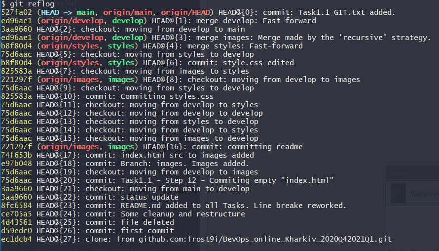

# Task 1.1 - DevOps intro to GitHub  
  
## DevOps is...  
a specific *mindset*.  
a *profession*, that is not suited for everyone.  
DevOps is like a **samurai**:  
- it's *NOT* about reaching destination  
- it's *about* following the path.  
> "Seven times down, eight times up."  
  
***
## Working with GIT  
*please check Task1.1_GIT.txt for details*  
```
git reflog  
```
**Image for reference**  
  
  
  
  
##Git Bash commands used:  
**Step 2: Account setup:**  
```
git config --global user.name "frost9i"  
git config --global user.email "sergii.moroz9i@gmail.com"  
```
  
**Step 4: Repository setup:**  
DevOps_online_Kharkiv_2020Q42021Q1 was created  
  
**Step 6: Cloning repository to local machine:**  
```
cd <path-to-folder>  
git clone https://github.com/frost9i/DevOps_online_Kharkiv_2020Q42021Q1.git  
```
  
**Steps 8+: Creating README file:**  
```
touch README.txt  
vim README.txt  
mv README.txt README.md  
git add .  
git commit -a -m "Adding README"  
```
  
**Steps 11+: Creating branch -> index.html -> committing:**  
```
git branch develop  
git checkout develop  
touch index.html  
git add index.html  
git commit -a -m "Committing empty index.html"  
```
  
**Steps 13+: Creating branch "images"  
```
git br images  
git co images  
**images copied to folder**  
git add *jpg  
git commit -a -m "Branch: images. Images added."  
git commit index.html -m "Image <src> added to file."  
```
...
**and so on..**  
  
  
***
Navigation:  
*[Next: Task2.1](https://github.com/frost9i/DevOps_online_Kharkiv_2020Q42021Q1/tree/main/m2/task2.1)*  
  

