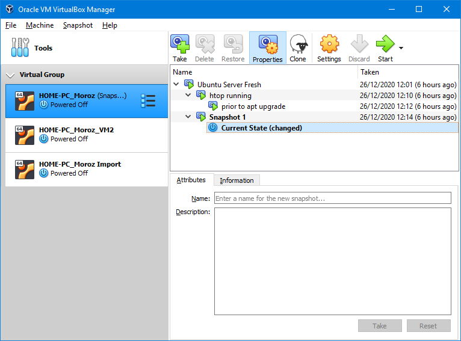
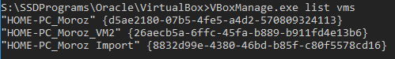
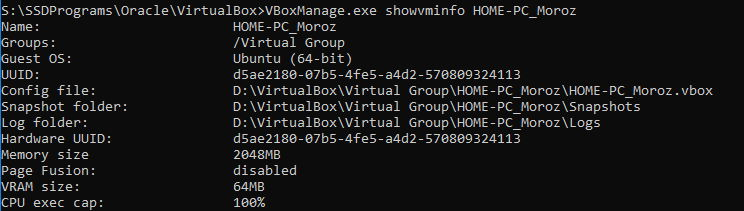
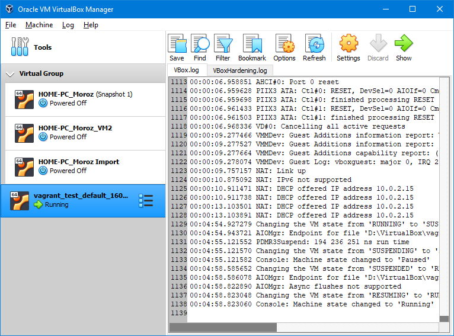

# Task 2.1 - Virtualization. VirtualBox, Vagrant
  
***  
  
## Part 1. Hypervisors  
#### 1. Hypervisors  
*Are divided into types (1, 2)*  
**Type 1** most popular hypervisors:  
- Xen (Citrix Systems),  
- Hyper-V (Microsoft),  
- KVM (Linux kernel community),  
- vSphere (VMware).  
  
**Type 2** most popular hypervisors:  
- VirtualBox (Oracle),  
- VMware Workstation.  
  
Most popular *Cloud service* providers use Type 1 hypervisors.
  
#### 2. Differences between Hypervisors  
**Type 1** Hypervisor is a layer of software that is installed directly onto physical hardware. It provides unobstructed performance and stability since it doesn't run inside OS of any type. *Mainly used for enterprise infrastructures.* Are able to dynamically allocate hardware resources to hosted VMs.  
  
**Type 2** Hypervisor is hosted inside of an OS of a physical host machine. Sometimes type 2 hypervisors are referred to as *hosted hypervisors*. Can be installed onto existing system without much changes and *are suitable for the environments with low performance demands*. Are easier to maintain, since snapshots can be created instantly.  
  
***  
  
### Part 2. Working with VirtualBox  
  
Taking snapshots  
  
  
#### Possible connections table  
| p2p 	| Host 	| VM1 	| VM2 	| WAN 	|
|-	|-	|-	|-	|-	|
| **Host** to 	| + 	| \* 	| \* 	| :heavy_check_mark: 	|
| **VM1** to 	| :heavy_check_mark: 	| + 	| :heavy_check_mark: 	| :heavy_check_mark: 	|
| **VM2** to 	| :heavy_check_mark: 	| :heavy_check_mark: 	| + 	| :heavy_check_mark: 	|
| **WAN** to 	| :heavy_check_mark: 	| \* 	| \* 	| + 	|
  
\* *is possible with additional port forwarding settings*  
  
```
VBoxManage list vms  
```
  
  
```
VBoxManage showvminfo <name>  
```
  
  
***  
### Part 3. Vagrant  
  
Allows you to add working OS environment on top of any other OS. Configuration files can be deployed to the cloud. Basically a headless machine controlled with CLI and pre-written scripts that can use one of mainstream *providers* like Virtualbox, Hyper-V, Docker and WMware.
  
Vagrant installation path added to system variables  
  
  
login: vagrant | password: vagrant
```
date  
```
  
  
  
Vagrant running in background  
  
  

***  
**Navigation:**  
*[Previous: Task 1.1](https://github.com/frost9i/DevOps_online_Kharkiv_2020Q42021Q1/blob/main/m1/task1.1/README.md)* | *[Next: Task 2.2](https://github.com/frost9i/DevOps_online_Kharkiv_2020Q42021Q1/blob/main/m2/task2.2/README.md)* | *[Task list](https://github.com/frost9i/DevOps_online_Kharkiv_2020Q42021Q1#1-task-list)*  
  