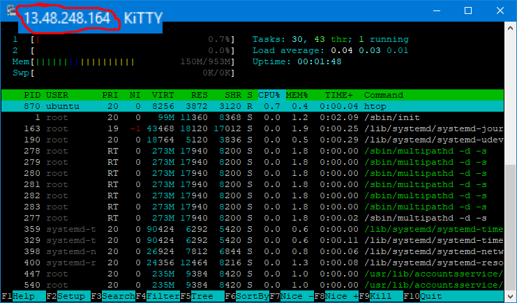
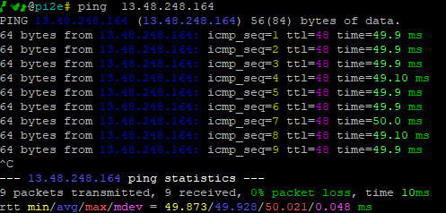
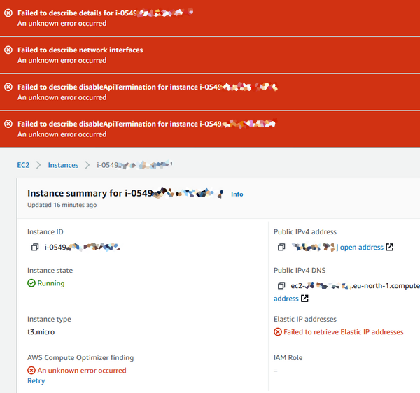

# Task 2.2 - Virtualization and Cloud Basics
  
***  
  
Step-by-step **re:Invent 2020** tutorials were explored:  
- Introduction to Amazon EC2,
- Automating AWS Services with Scripting and the AWS CLI,  
- Introduction to AWS Lambda,  
- Introduction to Elastic Block Store (EBS),  
- Hosting WordPress Using Amazon S3.  
  
***  
  
### EC2 Instance was created and is currently up and running  
  
  
  
#### Security groups are configured to allow external ICMP packets:  
  
  
upd29.12.2020 ip cnaged to: 13.53.104.51  
  
***
  
### Some errors were encountered during setup process
but disappeared too quickly to cause any inconveniences.  
  
  
  
***
  
### S3 bucket static web page
http://frost9i.s3.1.s3-website.eu-north-1.amazonaws.com  
  
  
***  
**Navigation:**  
[Previous: Task 2.1](https://github.com/frost9i/DevOps_online_Kharkiv_2020Q42021Q1/blob/main/m2/task2.1/README.md) | [Next: Task 3.1](https://github.com/frost9i/DevOps_online_Kharkiv_2020Q42021Q1/blob/main/m3/task3.1/README.md)  
  