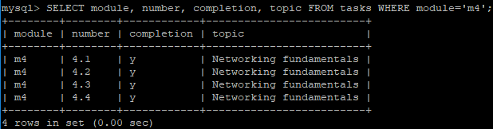
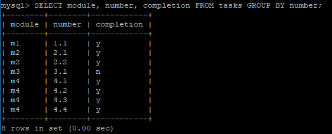
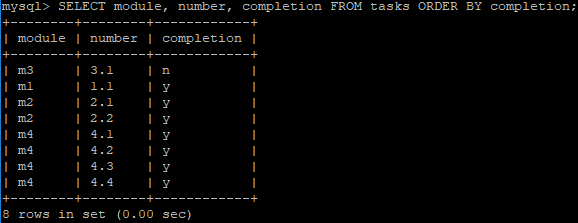
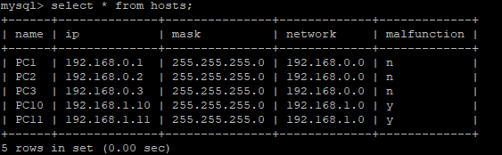
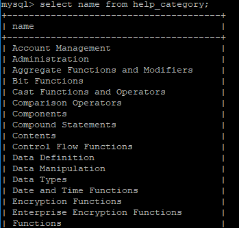
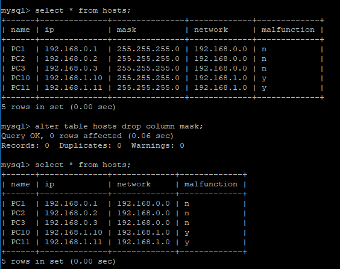

# Task 3.1 - Database administration  
  
***
  
## Part 1. - Installing MySQL server on VirtualBox VM  
  
```sh
sudo apt install mysql-server  
sudo mysql_secure_installation  
sudo mysql  
```
  
Creating first user:  
```sql
> CREATE USER 'sql-vm'@'localhost' IDENTIFIED BY 'sql-pswd';  
> GRANT CREATE, ALTER, DROP, INSERT, UPDATE, DELETE, SELECT, REFERENCES, RELOAD on *.* TO 'sql-vm'@'localhost';  
> FLUSH PRIVILEGES;  
> exit
```
  
Log in as a new user:  
```sh
mysql -u sql-vm -p  
```
  
Creating first user database:  
```sql
> CREATE DATABASE epam;  
> SHOW DATABASES;  
> USE epam;  
> SHOW TABLES;  
```
  
Creating the first table **tasks** for a database.  
The structure is going to be as following:  
| Column name 	| Data type 	| Example value 	|
| --- 	| ---: 	| :---: 	|
| number 	| VARCHAR(4) 	| 1.1 	|
| module 	| CHAR(2) 	| m1 	|
| completion 	| CHAR(1) 	| y 	|
| topic 	| VARCHAR(40) 	| Fundamentals 	|
  
```sql
> CREATE TABLE tasks (number VARCHAR(4), module CHAR(2), completion CHAR(1), topic VARCHAR(40), link > VARCHAR(120));  
> SHOW TABLES;  
```
  
Filling in the table:  
```
> show global variables like 'local_infile';  
```
  
If the result of the above command is:  
| Variable_name 	| Value 	|
| ----- 	| --- 	|
| local_infile 	| OFF 	|
  
execute  
```sql
> SET GLOBAL local_infile=true;  
> GRANT FILE, LOCK TABLES on *.* to 'sql-vm'@'localhost';  
> exit  
```
  
```sh
mysql --local_infile=1 -u sql-vm -p epam
```
  
Inserting prepared data from a file:  
```sql
> LOAD DATA LOCAL INFILE '/home/frost9i/mysql/db-tasks.txt' INTO TABLE tasks;  
> SELECT * FROM tasks;  
> SELECT module, number, completion, topic FROM tasks WHERE module='m4';  
```
  
  
  
```sql
> SET GLOBAL sql_mode=(SELECT REPLACE(@@sql_mode,'ONLY_FULL_GROUP_BY',''));  
> SELECT module, number, completion FROM tasks GROUP BY number;  
```
  
  
  
  
  
***
  
Creating another table:  
```sql
> CREATE TABLE hosts (name VARCHAR(5), ip VARCHAR(15), mask VARCHAR(15), network VARCHAR(15), malfunction CHAR(1));  
> INSERT INTO hosts VALUES ('PC1', '192.168.0.1', '255.255.255.0', '192.168.0.0', 'n');  
> INSERT INTO hosts VALUES ('PC2', '192.168.0.2', '255.255.255.0', '192.168.0.0', 'n');  
> INSERT INTO hosts VALUES ('PC3', '192.168.0.3', '255.255.255.0', '192.168.0.0', 'n');  
> INSERT INTO hosts VALUES ('PC10', '192.168.1.10', '255.255.255.0', '192.168.1.0', 'y');  
> INSERT INTO hosts VALUES ('PC11', '192.168.1.11', '255.255.255.0', '192.168.1.0', 'y');  
> SELECT * FROM hosts;  
```
  
  
  
***
  
## Part 2 - Backup and restore.  
  
### SQL queries are divided by categories:  
  
**DDL:** CREATE, ALTER, DROP, TRUNCATE, RENAME, COMMENT;  
**DML:** SELECT, INSERT, UPDATE, DELETE, MERGE, CALL, EXPLAIN PLAN, LOCK TABLE;  
**DCL:** GRANT, REVOKE;  
  
  
```sql
> USE mysql;  
> SELECT name FROM help_category;  
```
  
  
  
  
### Backup  
```sh
mysqldump epam hosts > epam_hosts.sql -p -u sql-vm  
cat epam_hosts.sql  
```
  
```sql
> use epam;  
> ALTER TABLE hosts DROP COLUMN mask;  
> SELECT * FROM hosts;  
```
  
  
  
### Restoring from backup  
```sh
mysql -u sql-vm -p epam < ~/mysql/epam_hosts.sql
```
  
### Exporting database  
```sh
mysqldump --add-drop-table -u sql-vm -pdsa epam > db-epam.sql  
```
  
### Importing database  
```sh
mysql -u sql_rds -h frost9iepam.chn46rcvikyt.eu-west-3.rds.amazonaws.com -P 3306 -p database < ~/mysql/db-epam.sql  
```
  
  
***  
**Navigation:**  
*[Previous: Task 2.2](https://github.com/frost9i/DevOps_online_Kharkiv_2020Q42021Q1/blob/main/m2/task2.2/README.md)* | *[Next: Task 4.1](https://github.com/frost9i/DevOps_online_Kharkiv_2020Q42021Q1/blob/main/m4/task4.1/README.md)* | *[Task list](https://github.com/frost9i/DevOps_online_Kharkiv_2020Q42021Q1#1-task-list)*  
  
  

