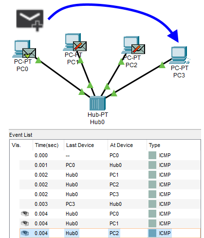
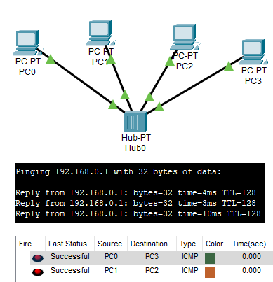
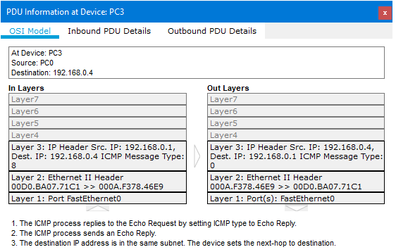
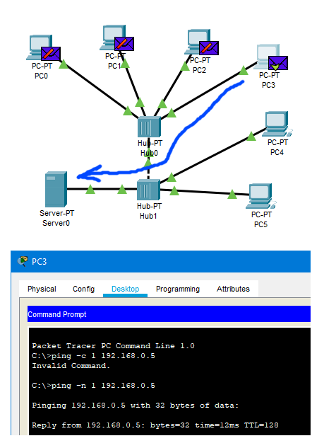
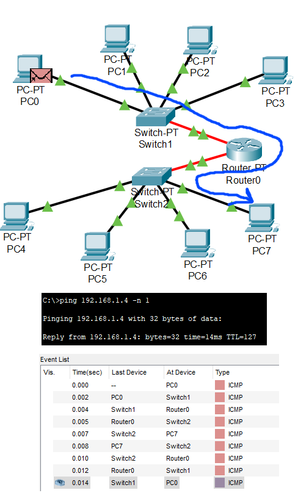

# Task 4.1 - Networking fundamentals  
  
### 1. Topology 1  
  
Topology 1 was created. IP addresses were assigned according to the table:  
| PC0 	| 192.168.0.1 	|
| PC1 	| 192.168.0.2 	|
| PC2 	| 192.168.0.3 	|
| PC3 	| 192.168.0.4 	|
  
SIMPLE PDU (Protocol Data Unit) was created and resulted in succesful delivery.  
Pinging from one workstation to another works as well.  
While stations have theirs IPs set this behaviour won't change.  
  
  
  
  
  
Simulation showed all the animation of ICMP packets being re-transmitted from the hub and receiving the answer from targeted PC. ICMP packets belong to OSI Layer 3, as shown in PDU information windows for a specific packet.  
  
  
  
***
  
### 2. Topology 2.  
  
This topology uses *switch* instead of hub. Switches incorporate the ability to send packets directly to the IP address, because they store the a simple routing table of the connected workstation and their MAC addresses to its ports. Thus reducing network traffic and network equipment loads.  
  
  
  
***
  
### 3. Topology 3  
  
Another topology was built. IP addresses were assigned, gateways set and router ports were turned on. This configuration allows to connect different networks into one cluster, thus expanding coverage and keeping network traffic within limits.  
  
  
  
  
***  
**Navigation:**  
[Previous: Task 1.1](https://github.com/frost9i/DevOps_online_Kharkiv_2020Q42021Q1/blob/main/m1/task1.1/README.md) | [Next: Task 2.2](https://github.com/frost9i/DevOps_online_Kharkiv_2020Q42021Q1/blob/main/m2/task2.2/README.md)  
  