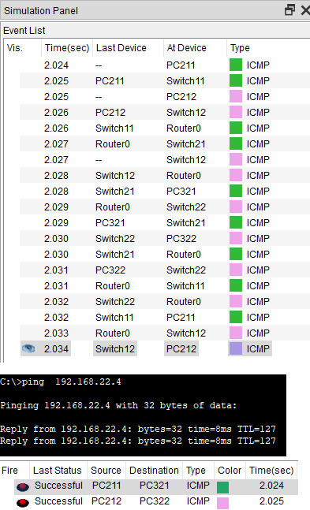
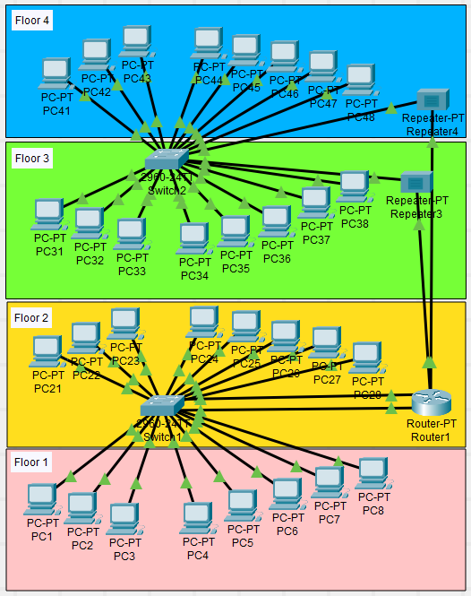
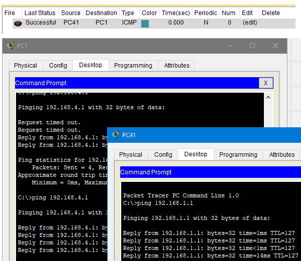
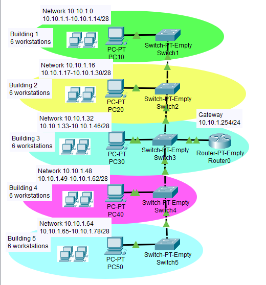
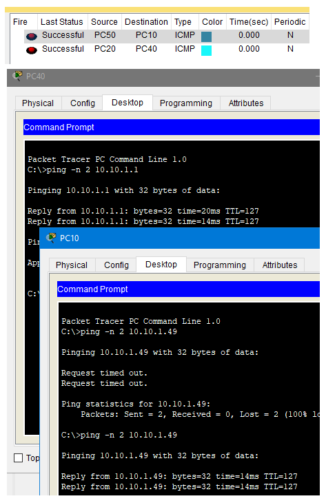

# Task 4.1 - Networking fundamentals  
  
***
  
## Part 1  
  
Network topology with two buildings was created.  
The naming and addressing was done using the location of the workstations.  
For example :point_right: *Building 1; Floor 1; PC 1* has an IP of *192.168.11.1*.  
And some more examples in a table:  
  
| Location 	| IP 	| Network 	| Gateway 	|
| --- 	| --- 	| --- 	| --- 	|
| Building 1; Floor 1; PC 1 	| 192.168.11.1 	| 192.168.11.0 	| 192.168.11.254 	|
| Building 1; Floor 2; PC 5 	| 192.168.21.5 	| 192.168.21.0 	| 192.168.21.254 	|
| Building 2; Floor 1; PC 2 	| 192.168.12.2 	| 192.168.12.0 	| 192.168.12.254 	|
| Building 2; Floor 2; PC 2 	| 192.168.22.2 	| 192.168.22.0 	| 192.168.22.254 	|
and so on...  
  
All workstation were configured. Packets are being sent and received :+1:  
  
  
  
  
  
  
***
  
## Part 2  
  
The following topology was built. Each floor share one network divided into subnets with /29 subnet mask. Giving 8 subnets in total.  

**For example:**  
Floor 1, Group 1 with 3 workstations belongs to  
192.168.1.0 network with IP range of 192.168.1.1-192.168.1.6  
*(192.168.1.7 is used for broadcast).*  
Floor 1, Group 2 with 5 workstations belongs to  
192.168.1.8 network with IP range of 192.168.1.8-192.168.1.14  
*(192.168.1.26 is used for broadcast).*  
...
  
Table shows configuration for selected units:  
| PC 	| IP/subnet 	|
| --- 	| --- 	|
| PC1 	| 192.168.1.1/29 	|
| PC4 	| 192.168.1.9/29 	|
| PC21 	| 192.168.2.1/29 	|
| PC24 	| 192.168.2.9/29 	|
| PC31 	| 192.168.3.1/29 	|
| PC41 	| 192.168.4.1/29 	|
  
Each subnet is being connected to the router' interfaces via switch of a repeater  
Router is configured to be present in both subnets per floor at once using 255.255.255.0 mask:  
| Router port 	| Assigned IP 	|
| --- 	| --- 	|
| 0/1 	| 192.168.1.254/24 	|
| 0/2 	| 192.168.2.254/24 	|
| 0/3 	| 192.168.3.254/24 	|
| 0/4 	| 192.168.4.254/24 	|
  
  
  
  
  
Topology allows communication between different building floors and uses minimum expensive equipment. Workstations belonging to one workgroup communicate to each other via switches. Workstations must have OS restrictions to prohibit IP change by user, to avoid switching to another workgroup at will.  
  
***  
  
## Part 3  
  
Topology with required constrains was created, featuring 5 workgroups 6 workstations each and using one router with one port.  
  
Whole network was divided into subnets using subnet mask.  
**Building one**: network 10.10.1.0, mask 255.255.255.240 (\/28)
with IP range of 10.10.1.1-10.10.1.14.  
*See the following image for details.*  
  
  
  
  
  
Each subnet interacts within itself and uses router for extra-subnet connectivity.  
  
***  
**Navigation:**  
[Previous: Task 4.1](https://github.com/frost9i/DevOps_online_Kharkiv_2020Q42021Q1/blob/main/m4/task4.1/README.md) | [Next: Task 4.3](https://github.com/frost9i/DevOps_online_Kharkiv_2020Q42021Q1/blob/main/m4/task4.3/README.md)  
  