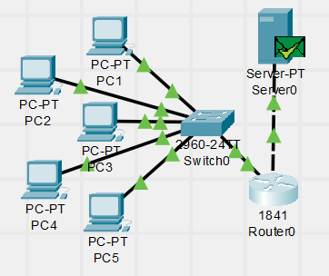
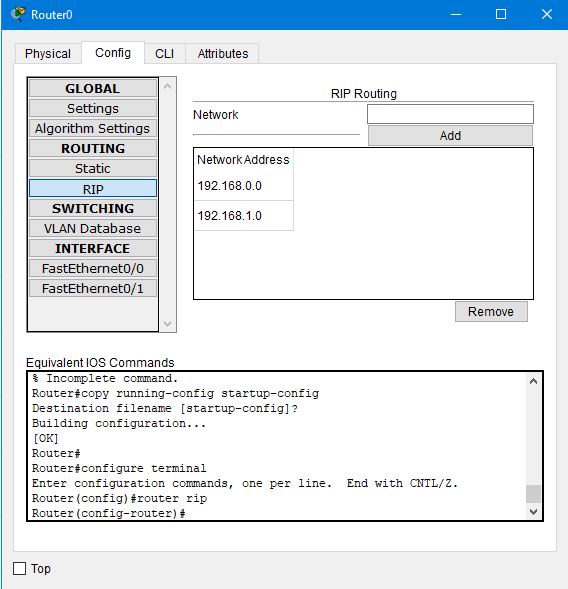
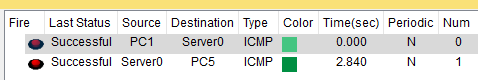

# Task 4.3 - Networking fundamentals  
  
***
  
Required topology was created.  
IP addresses were assigned.  
  
:twisted_rightwards_arrows: Network **192.168.0.0**  
:desktop_computer: PC1-PC5: 192.168.0.1-5/24  
:electric_plug: Router if0: 192.168.0.254/24  
  
:twisted_rightwards_arrows: Network **192.168.1.0**  
:computer: Server: 192.168.1.1/24  
:electric_plug: Router if1: 192.168.1.254/24  
  
  
  
  
:skull_and_crossbones: RIP (*Routing Information Protocol*) was configured on Router0  
Using GUI configuration tool.  
Working configuration was saved and will be available upon reboot.  
```sh
copy running-config startup-config  
```
  
  
  
  
ICMP packets were able to get from source to destination and back.  
  
    
  
  
***  
**Navigation:**  
[Previous: Task 4.2](https://github.com/frost9i/DevOps_online_Kharkiv_2020Q42021Q1/blob/main/m4/task4.2/README.md) | [Next: Task 4.4](https://github.com/frost9i/DevOps_online_Kharkiv_2020Q42021Q1/blob/main/m4/task4.4/README.md)  
  