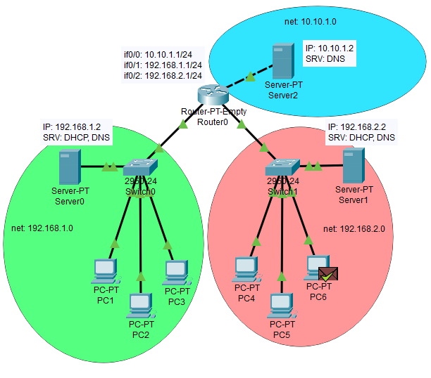
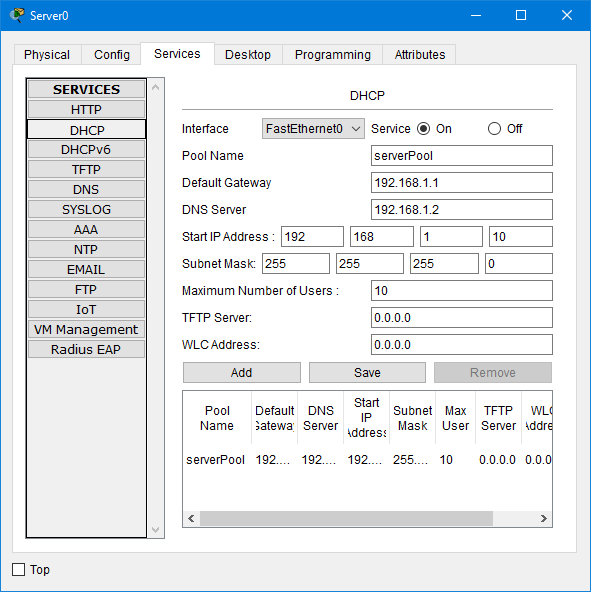
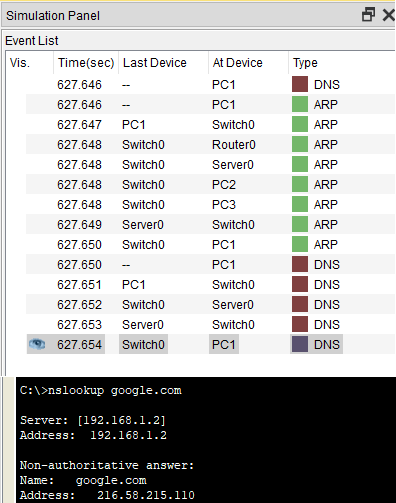

# Task 4.4 - Networking fundamentals  
  
***
  
## DNS server setup  
  
The following topology was created that includes:  
two networks, each with its own DNS server and a third DNS server in WAN.  
  
*Too bad Packet Tracer doesn't support DNS forwarding*  
  
  
  
DHCP service was also enabled on local servers to save time on configuring **static IP** addresses on workstations.  
  
  
  
  
Inside network 192.168.1.0 workstation are able to receive answers from local DNS server.  
```
nslookup google.com  
```
  
  
  
  
  
Workstation are able to get an answer from external network server as well.  
  
  
  
  
***  
**Navigation:**  
*[Previous: Task 4.3](https://github.com/frost9i/DevOps_online_Kharkiv_2020Q42021Q1/blob/main/m4/task4.3/README.md)* | *[Next: Task 5.1](https://github.com/frost9i/DevOps_online_Kharkiv_2020Q42021Q1/blob/main/m5/task5.1/README.md)* | *[Task list](https://github.com/frost9i/DevOps_online_Kharkiv_2020Q42021Q1#1-task-list)*  
  