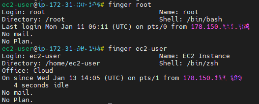
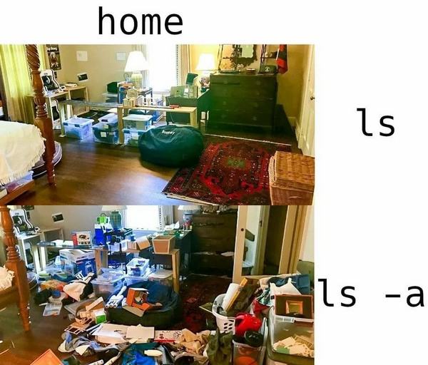

# Task 5.1 - Linux essentials  
  
***
  
## Part 1.  
  
Being logged it as `root` user can perform any system commands without using `sudo` modifier.  
*Root is better not to be used with password authentication.*  
Changing root password: `passwd`  
Changing `<user>` password as `root`: `passwd <user>`  
Encrypted passwords are stored in *\/etc\/shadow* in a form of hash:  
```
root:*LOCK*:14600::::::
adm:*:18313:0:99999:7:::
ec2-user:$6$KcUtT2Dd$LtF27FeXUNvW3wMHgQjkeS9ONub1m30zq5.k.D7Q7hXyYrTPHKKgs8qM1VlbfgDyXYsj1yOoY.HByydRfYLZm0:18638:0:99999:7:::
```
In the example `&6&` stands for SHA-512 algorithm.  
  
Command `getent passwd` lists all users in the system. Those with normal access will have shell name at the end of line: `/bin/bash`.  
Command `lslogins -u` can be used as an alternative.  
***
### Checking and changing user personal information.  
Utility `cnfn` allows to change user information.  
Program `finger` shows user information when executed.  
It had to be installed prior usage, because it's not a part of default setup.  
```
yum provides chfn  
yum install util-linux-user  
sudo chfn <user>
finger <user>  
```
  
  
Upon checking help information on above mentioned commands `man finger` and `man chfn` were used. Command `finger` has four keys in total that don't really make much difference for the output.  
`chfn -u` displays help for command options.  
`chfn -f` changes user full name  
`-o` office; `-h` home; and so on.

```
sudo chfn -f 'Name Surname' <user>  
finger <user>
```
***
### `more` vs. `less`  
These two commands work in a similar way, but `less` is *more* preferable nowadays as it includes features `more` lacks. The fastest of two is also `less` as it doesn't load the file all at once, but proceeds gradually, fragment by fragment. Also less has *more* interactivity to it, so it can be used instead of `tail -f` by running it with option `less +F` or pressing `Shift+F` in already running command.  
Conclusion: `less` is `more` with more features.  
```
cat .zshrc | less -20 -e  
```
Will show 20 new lines each time when `Enter/Space/PgDn` pressed from `.zshrc` configuration user file and will exit upon reaching \>EOF\<.  
***
### Listing `home` directory content  
  
When using `ls -lA` it lists all files that are present in the current directory.  
Example of output:  
```
-rwxrw-r-- 1 user group 0 Jan 13 23:52 hostname  
```
Where the first symbol will mean a type of file:  
1. `-` : regular file  
1. `d` : directory  
1. `c` : character device file  
1. `b` : block device file  
1. `s` : local socket file  
1. `p` : named pipe  
1. `l` : symbolic link  
  
***
  
## Part 2.  
  
 
  
  
  
  
  
  
  
  
  
    
***  
**Navigation:**  
*[Previous: Task 4.4](https://github.com/frost9i/DevOps_online_Kharkiv_2020Q42021Q1/blob/main/m4/task4.4/README.md)* | *[Next: Task 5.2](https://github.com/frost9i/DevOps_online_Kharkiv_2020Q42021Q1/blob/main/m5/task5.2/README.md)* | *[Task list](https://github.com/frost9i/DevOps_online_Kharkiv_2020Q42021Q1#1-task-list)*  
  
  
