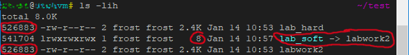

# Task 5.1 - Linux essentials  
  
***
  
## Part 1.  
  
Being logged it as `root` user can perform any system commands without using `sudo` modifier.  
*Root is better not to be used with password authentication.*  
Changing root password: `passwd`  
Changing `<user>` password as `root`: `passwd <user>`  
Encrypted passwords are stored in *\/etc\/shadow* in a form of hash:  
```
root:*LOCK*:14600::::::
adm:*:18313:0:99999:7:::
ec2-user:$6$KcUtT2Dd$LtF27FeXUNvW3wMHgQjkeS9ONub1m30zq5.k.D7Q7hXyYrTPHKKgs8qM1VlbfgDyXYsj1yOoY.HByydRfYLZm0:18638:0:99999:7:::
```
In the example `&6&` stands for SHA-512 algorithm.  
  
Command `getent passwd` lists all users in the system. Those with normal access will have shell name at the end of line: `/bin/bash`.  
Command `lslogins -u` can be used as an alternative.  
***
### Checking and changing user personal information.  
Utility `cnfn` allows to change user information.  
Program `finger` shows user information when executed.  
It had to be installed prior usage, because it's not a part of default setup.  
```
yum provides chfn  
yum install util-linux-user  
sudo chfn <user>
finger <user>  
```
  
  
Upon checking help information on above mentioned commands `man finger` and `man chfn` were used. Command `finger` has four keys in total that don't really make much difference for the output.  
`chfn -u` displays help for command options.  
`chfn -f` changes user full name  
`-o` office; `-h` home; and so on.

```
sudo chfn -f 'Name Surname' <user>  
finger <user>  
```
*Alternatively user personal info can be modified manually as a plain text in `/etc/passwd` file.*  
  
***
### `more` vs. `less`  
These two commands work in a similar way, but `less` is *more* preferable nowadays as it includes features `more` lacks. The fastest of two is also `less` as it doesn't load the file all at once, but proceeds gradually, fragment by fragment. Also less has *more* interactivity to it, so it can be used instead of `tail -f` by running it with option `less +F` or pressing `Shift+f` in already running command.  
Conclusion: `less` is `more` with more features.  
```
cat .zshrc | less -20 -e  
```
Will show 20 new lines each time when `Enter/Space/PgDn` pressed from `.zshrc` configuration user file and will exit upon reaching \>EOF\<.  
***
### Listing `home` directory content  
  
When using `ls -lA` it lists all files that are present in the current directory.  
Example of output:  
```
-rwxrw-r-- 1 user group 0 Jan 13 23:52 hostname  
```
Where the first symbol will mean a type of file:  
1. `-` : regular file  
1. `d` : directory  
1. `c` : character device file  
1. `b` : block device file  
1. `s` : local socket file  
1. `p` : named pipe  
1. `l` : symbolic link  
  
***
  
## Part 2.  
  
#### Using `tree`  
Option `-L <number>` sets maximum display depth level of directory tree.  
Option `-C` turns colourization ON.  
Option `-P` performs pattern search, where '*' is *any zero or more characters*.  
Option `-p` print file permissions is really useful when searching for vulnerabilities.  
Example:  
```
tree -C -P '*c*' -L 2 -p /
```
#### File type  
To determine a file type command `file` is used, `file -l` lists all known file formats and their strength for matching. Command `file 1.txt` will give an output:  
```
1.txt: ASCII text
```
  
Command `file /usr/bin/ping` will give an output:  
```
/usr/bin/ping: ELF 64-bit LSB pie executable, x86-64, version 1 (SYSV), dynamically linked, interpreter /lib64/ld-linux-x86-64.so.2, BuildID[sha1]=76f7a7aa8a6ac8dde974d9884345c002bae37686, for GNU/Linux 3.2.0, stripped
```
There are certainly other tools for determining *executables*, like `ldd`, `ltrace`, `hexdump`, `readelf`, etc. But they are out of scope of this task and will be used in a later course.  
  
#### Home directory  
User can return to his `/home/<user>` directory using commands `cd` or `cd ~`.  
  
#### `ls` command.  
`ls` is used to list directories content.  
Option `-a` is used to show *all* files, including hidden and system folders, as `.` and `..`.  
Option `-A` is considered as more practical, as it omits showing `.`&`..` directories, as they are being common for every location.  
Option `-l` is used to show content in long format, showing **detailed** file information.  
Some useful aliases can be added to the user shell configuration file, such as:  
```
.bashrc  
alias la='ls -A'
alias ll='ls -lA'
alias lh='ls -lhA'
```
  
#### Sequence of operations 1  
```
cd ~  
mkdir test  
cd test  
ls -lh / > list.txt  
cat list.txt  
cp list.txt ..  
cp list.txt /home/user/list_copy.txt  
cd ..  
rm -ri test  
rm list*  
```
  
#### Sequence of operations 2  
```
cd  
mkdir test  
cp .zshrc test/labwork2  
cd test  
ln labwork2 lab_hard  
ln -s labwork2 lab_soft  
ls -lih  
```
  
Hardlinks share the same *inode* and have the same size.  
Softlinks (or symbolic links) contain only a link to the original file by its path, thus having smaller size. Also symlinks have letter `l` in the file description which stands for `link file`, example `lrwxrwxrwx`.  
Command `file lab_soft` shows:  
```
lab_soft: symbolic link to labwork2  
```
Original file can be modified via symlink `vim lab_soft`. The *datestamps* the original file and hardlink will be updated but on symlink the date will remain from the time of creation.  
```
mv lab_hard hard_lnk_labwork2  
mv lab_soft symb_lnk_labwork2  
rm labwork2  
```
Symbolic link would still be connected to the same location, but the file date will no longer be accessible. Hardlink will keep all information.  
  
#### `locate` utility  
```
sudo updatedb  
locate squid  
locate traceroute  
```
  
#### Mounted system partitions  
Can be checked inside `/etc/fstab` file.  
```
/dev/sda1               /               ext4            rw,relatime     0 1
/dev/sda2               none            swap            defaults        0 0
```
  
`lsblk` can show all block devices and their mount points.  
```
NAME   MAJ:MIN RM  SIZE RO TYPE MOUNTPOINT
sda      8:0    0 12.3G  0 disk
├─sda1   8:1    0   10G  0 part /
└─sda2   8:2    0  2.3G  0 part [SWAP]
sr0     11:0    1 1024M  0 rom
```
  
Partition information can be displayed by using one of the utilities: `fdisk -l`, `df -h | grep /dev`. Swap partitions and their usage can be checked using `swapon -s` command.  
  
#### Counting number of lines  
Two command can be used `grep` and `wc` on their own or in different combinations.  
```
grep -c "alias" .zshrc  
cat .zshrc | grep -c "alias"  
cat .zshrc | grep alias | wc -l  
```
  
#### `find` utility  
Search files recursively in `/etc` containing *host* string in them and output line and file location.  
```
sudo find /etc -maxdepth 1 -type f -exec grep -H 'host' {} \;  
sudo find /etc/*ss* -maxdepth 1  
sudo find /etc/* -maxdepth 1 | cat | grep -H 'ss'  
```
  
#### Screen-by-screen `/etc` directory content printout  
```
sudo ls -l -R /etc | less -20
```
  
#### Linux device types  
Device type can be determined by its name and location.  
`/dev/console` - system console;  
`/dev/hd` - IDE disk drive;  
`/dev/sd` - SCSI disk drive;  
`dev/fd` - floppy disk;  
`/dev/tty` - virtual console;  
`/dev/null` - 'black hole' device used as input.  
  
#### Linux FS types  
Command `df -Th` is used, where `-T` prints type of file system.  
There are different types of file systems, that can be categorized by usage for media *random access*, *sequential* media access, *optical* media, *virtual* and *network* file systems.  
Most popular are: **FAT32, NTFS, ext4, ReiserFS, NFS** and so on.  
  
#### Recently used `/etc` directory files  
```
ls -lt  /etc  | head -6
```
  
  
  
***  
**Navigation:**  
*[Previous: Task 4.4](https://github.com/frost9i/DevOps_online_Kharkiv_2020Q42021Q1/blob/main/m4/task4.4/README.md)* | *[Next: Task 5.2](https://github.com/frost9i/DevOps_online_Kharkiv_2020Q42021Q1/blob/main/m5/task5.2/README.md)* | *[Task list](https://github.com/frost9i/DevOps_online_Kharkiv_2020Q42021Q1#1-task-list)*  
  
  
