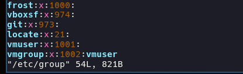
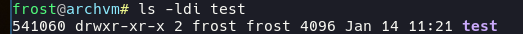

# Task 5.2 - Linux essentials  
  
***
  
## Analyzing `/etc/passwd/` & `/etc/group` system files  
  
#### `/etc/passwd` file contains the list of all system users and their attributes  
`:` is used for the separation of fields:  
  
The structure of each record is as follows:  
| Field | Description |
| :---: | --- |
| vmuser | unique \<user\> name |
| x | password stored in `/etc/shadow` indicator |
| 1001 | unique user ID |
| 1001 | corresponding group ID |
| ` ` | comment field that contains extra user information |
| `/home/vmuser` | absolute path to user home directory |
| `/bin/bash` | absolute path to user command or shell |
  
  
Working system includes many users, that can be distinguished by their IDs:  
| ID range | User classification |
| :---: | --- |
| 0 | `root`, the most privileged system user |
| 1 - 99 | predefined accounts (system daemons, pseudousers) |
| 100 - 999 | reserved by system for system administrative and account groups |
| 1000+ | regular users IDs |
  
  
#### `/etc/group` file contains the list of all system groups and users, that belong to each of them  
  
The structure of each record is as follows:  
| Field | Description |
| :---: | --- |
| vmgroup | unique \<group\> name |
| x | can store encrypted password |
| 1002 | unique group ID |
| vmuser | users that belong to the group |
  
User that have this group as their primary in `/etc/passwd` do not have to be included.  
  
  
## About UID and GID  
UID - User IDentity  
GID - Group IDentity  
  
User and Group identification numbers are set upon creation in iterative manner, meaning that each new created user will have *+1* to his ID compared to the last created user.  
  
User can be created with a specified UID using following command:  
`sudo useradd -u 2001 -m vmuser2`  
where `-u 2001` sets the value of UID, that can be checked using  
`id -u vmuser2`  
  
The same goes to GID, each newly created group takes unoccupied group ID,
or it can be manually set using following command:  
`sudo groupadd -g 2002`  
  
Manual definition of UID and GID allows creating user or group with any ID, even in 1 - 999 range. If the ID is already taken the system message will appear:  
`useradd: UID 1 is not unique`  
  
***
  
#### How to determine if user belongs to a specific group?  
There're many utilities to perform this task. Some require installation, but I prefer methods that are already on board:  
```
getent group vmgroup
```
The reverse lookup command to determine groups that user is in:  
```
id vmuser
id -Gn vmuser
```
  
#### How to add user to the system and what parameters to use?  
```
sudo useradd <username>
sudo passwd <username>
```
Additional options can be included, like:  
`-m` - create home directory, if doesn't exist;  
`-M` - don't create home directory if it is set to create homedir by default;  
`-u` - set specific UID;  
`-s` - define specific user shell, e.g. `/bin/zsh`;  
`-p` - set password in CLI;  
`-g` - define main group user is in;  
```
sudo useradd -m -u 2002 -s /bin/zsh testuser
```
  
#### How to change user name of an existing user?  
Changing user name requires following steps:  
- Force user logout and stop all running services;  
- Change user name to a new one;  
- Rename user home directory, and move content from previous one;  
- Rename user group;
- PROFIT!  
```
sudo pkill -9 -u vmuser2
sudo usermod -l vmuser2 vmuser3
sudo usermod -d /home/vmuser3 -m vmuser2
sudo groupmod -n vmuser2 vmuser3
```
  
#### What is SKEL_DIR and what is its structure?  
When creating a new user using `sudo useradd -m <name>` command, that creates new user and according user directory, option `-k` can be included. This copies prepared files and directories form the *skeleton directory* to a newly created user directory.  
  
If this option is not set the skeleton directory is defined by the *$SKEL* variable in that is `/etc/skel` by default.
  
#### How to remove user from the system?  
User can be removed using `sudo userdel <user>` command.  
Running `sudo killall -u <user>` prior to deleting the user is a good touch.  
In case of using `-r` option user files in his home directory will be removed as well as the homedirectory itself. This command option also removes `$MAIL_DIR` - mail spool directory, thus removing user mailbox.  
  
#### How to lock and unlock user account?  
Command `sudo usermod -L <user>` must be the most common way of doing it.  
But it can also be done by running `sudo passwd -l <user>`, which gives similar outcome.  
User can be locked out of the system by setting user's shell to `/sbin/nologin`:  
`sudo usermod -s /sbin/nologin <user>`  
**Unlocking** is done by running either command:  
```sh
sudo usermod -U <user>
sudo passwd -u <user>
```
**Checking** what if user's password is locked (checks user status):  
`passwd -S <user>` or by checking `/etc/shadow` directly.  
  
#### Password-free login and subsequent password change  
`sudo passwd -d -e <user>` removes user password sets expiration flag, which will prompt user to change his password on the next login and allegedly allows user to login into the console without a password, but I couldn't prove it works.  
  
  
### Directory extended information format displaying and understanding  
`ls -ldi /path/to/test_dir` command is used.  
`-l` provides long list format of permissions;  
`-d` displays directory information, but not its content;  
`-i` to show inode information.  
  
  
  
This directory has inode number of 541060, it's definitely a directory as it has `d` as a file type.  
`d` `rwx` `r-x` `r-x`  
`rwx` shows that the owner has full access to the directory by being allowed to perform *read/write/execute* on it. Who is the owner is shown in the following line: `frost`.  
`r-x` stands for enabled *read/execute* permissions for a group users (users that belong to the group `frost`).  
`r-x` are the permissions for all other system users, which means anyone can read the content of the directory and perform run executable scripts in it.  
  
Next number `2` shows the amount of hardlinks being linked to the inode of this directory: one is directory itself, and the second is a directory `.` from inside of `test` directory.  
  
Filesystem formated size block directory occupies and the date and time it was created.  
  
  
#### Command used for changing the owner of the file/directory  
Command `chown` can be used for changing an owner or/and a group.  
`chown <user2> <file>` changes the owner of \<file\> to \<user2\>  
`chown -R <user2>:<group2> <dir>` changes owner and a group of directory content recursively.  
*UID and GID can be used to reference the user and group.*  
  
`chown :<group2> <dir>` is basically equal to `chgrp <group2> <dir>`  
***
  
### Access rights: symbolic/octal representation
Command `chmod` to change file mode bits can be used either with symbolic representation or with an octal number to set the bit pattern of a file or directory.  
**Symbolic way:**  
u - user; g - group; o - others; a - all;  
`chmod g+rwx` gives the group a file belongs to the rights to read, write and execute.  
`chmod o-rw` takes away the permission to read and write from users that do not own or belong to the same group a file belongs to.  
`chmod a+x` gives rights to user, group and others to be able to execute the file.  
  
**Octal representation:**  
4 = read, 2 = write, 1 = execute  
and all of the combinations making the sum, e.g.:  
5 = read and execute (but not to write),  
6 = read and write (bo not to execute),  
7 = the same as `rwx`.  
`chmod 755 <file>` 
  
#### `umask` command  
Command is used for removing access rights. For example `umask 022` removes write permissions from group and others, leaving owner rights unchanged. Can't be used to remove sticky bits.  
***
  
### Sticky bits: SUID, GUID  
Sticky bit (when set) is represented as `t` in third triplet of directory access rights instead of `x` and prevents the deletion of a folder and its content bu other users that have `w` permission.  
Can be set in symbolic and octal forms.  
`chmod o+t <dir>` = `chmod 1755`  
If by checking with `ls -l` this sticky bit is being capital `T` this means something is not right, which is because sticky bit can be assigned only to folder that has already `execute` permission set for *others*.  
  
If sticky bit is to be set on user it's called SUID, which results in file being being executed with the rights of the owner: `chmod u+s` or `chmod 4755`.  
If by checking with `ls -l` sticky bit in the first triplet is capital `S` the file in question do not have executable permissions and those must be set.  
  
To set GUID sticky bit user:  
`chmod 2755` or `chmod g+s` which will make all new files created in the directory by any user belong to the group that directory belongs to.  
***
  
### Command script  
BASH Script is a scripting programming language and is used to perform multiple operations according to different conditions in a linux CLI environment.  
Basic syntax is:  
```sh
#!/bin/bash
echo "This is a BASH script"
echo "It prints the content of each *.txt file in the directory"
ls *.txt | xargs tail -n +1
```
Script file must have executable permissions:  
`chmod 775 script.sh` and executed using `./script.sh` command.  
  
  
***  
**Navigation:**  
*[Previous: Task 5.1](https://github.com/frost9i/DevOps_online_Kharkiv_2020Q42021Q1/blob/main/m5/task5.1/README.md)* | *[Next: Task 5.3](https://github.com/frost9i/DevOps_online_Kharkiv_2020Q42021Q1/blob/main/m5/task5.3/README.md)* | *[Task list](https://github.com/frost9i/DevOps_online_Kharkiv_2020Q42021Q1#1-task-list)*  
  
  
